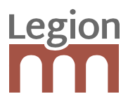

Automagically instruments, and embeds 3rd-party APIs as Legion IO actions.

When an API is proxified, you can call .chain() to continue to another action, or access proxy instances of any of its members.
As a result, it's often possible to use much of a 3rd-party API verbatim, only replacing .then() with .chain().

The wrapped API must be promise-based.

API
===

	const proxify = require('legion-io-proxify');
	
	proxify(require('my-library')).my_member_variable.myMethodCall()['my-array-access'].chain(result => ...)

proxify(api : any, options : object)
---------------------------

Wraps an API to make it chainable.

Options:
 * apiname : string - the human-readable name of the API, used to display proxied values for debugging purposes.

Environment Variables
=====================

Set LEGION\_PROXY\_LOG to trace proxy operations.
